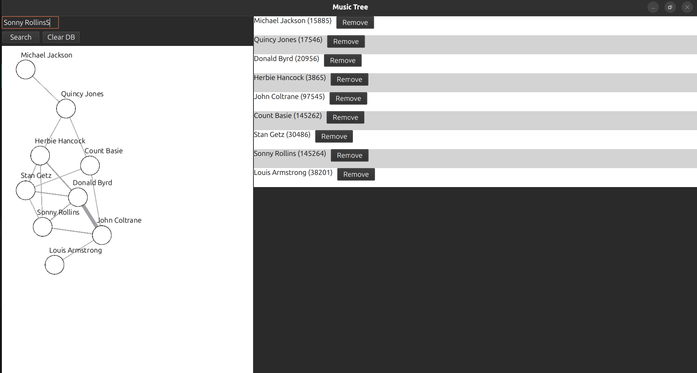

# music-tree 

music-tree is an interactive application that lets you search for musicians and visualize their collaborations as an undirected graph. It provides a dynamic way to explore interconnected artists and their work. 

<p align="center">
    
</p>

## Features 

- **Search artists** through the [Discogs API](https://www.discogs.com/developers/) 
- **Interactive graph visualization** of artist collaborations 
- **Local caching** with SQLite for faster repeated queries 
- **Qt (C++ and QML)** based UI with custom modules 
- Smooth, draggable graph nodes for exploring connections 

## Motivation 

This project was built as a way to explore the Qt framework while developing a useful and visually engaging tool.

I had no prior experience with Qt before starting, and I used an AI copilot (ChatGPT) to accelerate boilerplate development and identify knowledge gaps. This helped me both learn faster and produce a functioning application more efficiently.

## Tech Stack 

- **Qt 6** (C++ and QML) 
- **Discogs API** 
- **SQLite** 
- **CMake** build system 

## Requirements 

To compile and run music-tree on Ubuntu (tested on **Ubuntu 24.04**), install the following packages: 

```bash
sudo apt update
sudo apt install -y \
  qt6-base-dev \
  qt6-tools-dev \
  qt6-base-dev-tools \
  libqt6sql6-sqlite \
  cmake \
  g++
```

If you installed Qt via the Qt Online Installer, you’ll need to provide the CMake prefix path (see below).


## Setup
### 1. Clone and build
```
git clone https://github.com/WorldZage/music-tree.git
cd music-tree/music-tree
mkdir build && cd build
cmake ..
cmake --build .
./appmusic_tree
```

#### Qt Online Installer
Note: If Qt was installed via the online installer, specify the CMake prefix path:
```
cmake .. -DCMAKE\_PREFIX\_PATH=/path/to/Qt/6.x.x/gcc_64/lib/cmake
```
Replace /path/to/Qt/6.x.x/gcc_64/lib/cmake with the folder that contains Qt6/Qt6Config.cmake. You can locate it with:
```
find ~/Qt -name "Qt6Config.cmake"
```

### 2. Configure
music-tree requires a Discogs API token
Create an account, generate a personal token, and save it in a configuration file called "music-tree-config.ini".
The file must be placed in the standard Qt App configuration directory for your OS [Qt Documentation: standardpaths](https://doc.qt.io/qt-6/qstandardpaths.html) (AppConfigLocation). On Linux, this is typically:
"~/.config/appmusic\_tree" or "/etc/xdg/appmusic\_tree"

The file must have with the following structure:
[discogs]
token=<Personal access token>

The application will read this file at runtime.

### 3. Database
A local SQLite database is automatically created and used for caching artist and collaboration data. No manual setup is required.

## Roadmap
* Storing and Loading collections of artists by file
* Expanded graph navigation (panning, zooming)
* Improved layout algorithms for larger networks
* Add album and track-level graphing
* Export graph visualizations as images
* Customizable graph styles (colors, themes)

## License
This project is licensed under the GNU Lesser General Public License v3 (LGPL-3.0). See the LICENSE

